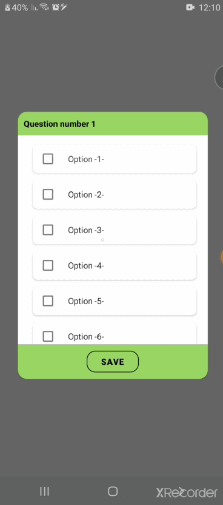
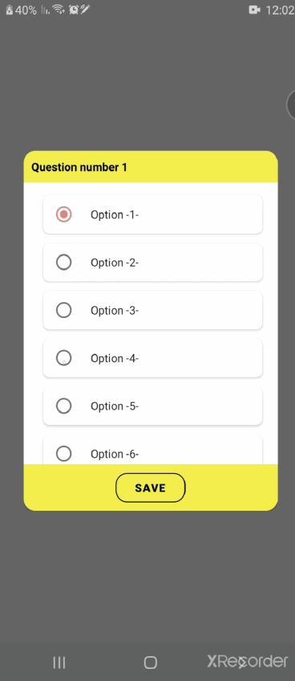
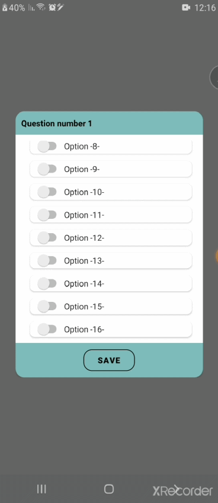

# RecyclerPickerDialogLibraryApp

[](https://jitpack.io/#AvrahamRada/RecyclerPickerDialogLibraryApp)

## Description:
```
My library create a dynamic dialog frame to the user.
the user just need to forward those information to the library:
 1. user's new title.
 2. type of dialog frame (0 - CheckBox, 1 - Radio Button and 2- switch)
 3. user's data (as array/list of strings).
 4. user's prefered color. 
```

## Setup:
Step 1. Add it in your root build.gradle at the end of repositories:
```
allprojects {
    repositories {
          maven { url 'https://jitpack.io' }
    }
}
```

Step 2. Add the dependency:

```
dependencies {
      implementation 'com.github.AvrahamRada:RecyclerPickerDialogLibraryApp:1.00.02'
}


```
## Usage

      

To display green dialog with checkBox:
```java                    

String[] userData = {"Option -1-", "Option -2-", "Option -3-", "Option -4-", "Option -5-"};
MyOwnCustomDialog myFragment = new MyOwnCustomDialog("User Title", 0, userData, Color.argb(255, 153, 201, 99));
myFragment.show(getSupportFragmentManager(), "User TAG");

```
## License

    Copyright 2020 Alon Lubinski

    Licensed under the Apache License, Version 2.0 (the "License");
    you may not use this file except in compliance with the License.
    You may obtain a copy of the License at

       http://www.apache.org/licenses/LICENSE-2.0

    Unless required by applicable law or agreed to in writing, software
    distributed under the License is distributed on an "AS IS" BASIS,
    WITHOUT WARRANTIES OR CONDITIONS OF ANY KIND, either express or implied.
    See the License for the specific language governing permissions and
    limitations under the License.
